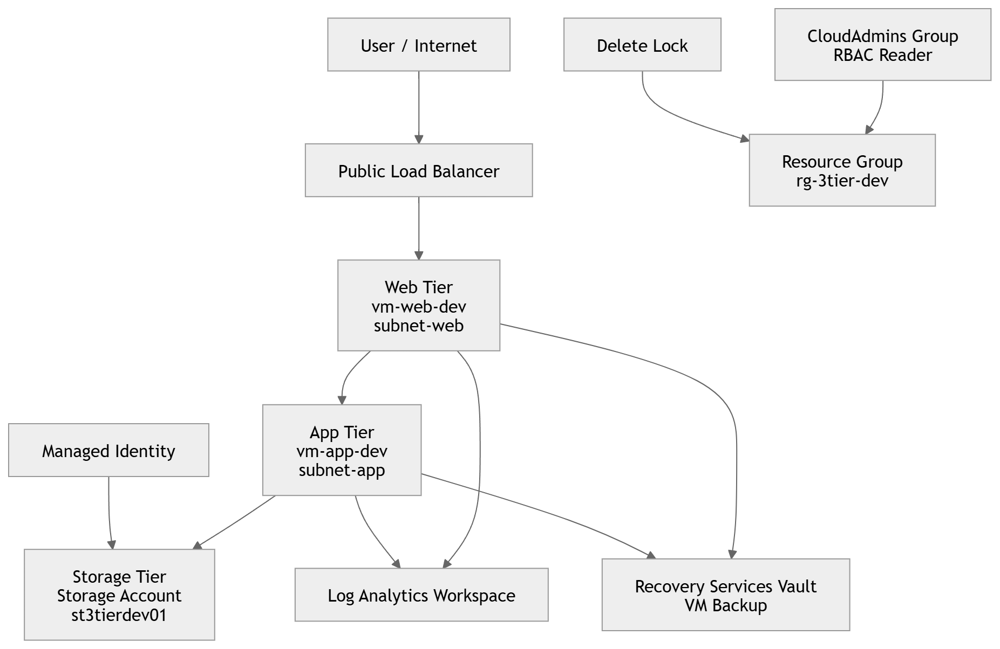
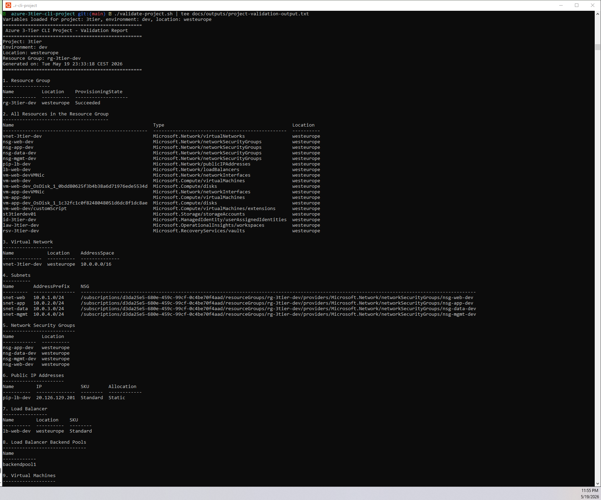
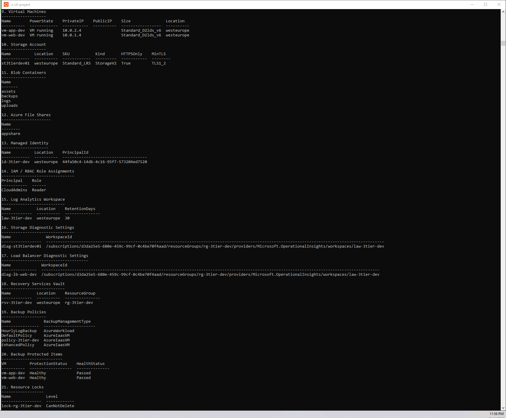

# Azure 3-Tier Infrastructure Automation with Azure CLI & Bash


> Production-style Azure infrastructure automation project that deploys a complete 3-tier environment using modular Bash scripts and Azure CLI.

---

## Executive Summary

This project demonstrates how a cloud engineer can provision, validate, and manage a complete Azure environment using Bash scripting and Azure CLI.

The solution automates networking, compute, storage, identity, monitoring, backup, and governance resources in Microsoft Azure.

---

## Architecture Diagram



---

## Project Screenshots

### Deployment Execution


### Azure Portal Resource Overview


### Validation Report





---

## Architecture Components

| Layer | Azure Services |
|------|------|
| Networking | Virtual Network, Subnets, NSGs, Public IP, Load Balancer |
| Compute | Linux Virtual Machines |
| Storage | Storage Account, Blob Containers, File Share |
| Identity | Entra ID Security Group, Managed Identity, RBAC |
| Monitoring | Log Analytics Workspace, Diagnostic Settings |
| Backup | Recovery Services Vault, Backup Policy |
| Governance | Resource Lock, Tags |

---

## Network Design

| Subnet | Address Space | Purpose |
|------|------|------|
| `snet-web` | `10.0.1.0/24` | Internet-facing web tier |
| `snet-app` | `10.0.2.0/24` | Internal application tier |
| `snet-data` | `10.0.3.0/24` | Data and storage services |
| `snet-mgmt` | `10.0.4.0/24` | Management and administration |

---

## Repository Structure

```text
azure-3tier-cli-project/
├── config/
│   └── tags.json
├── docs/
│   ├── architecture-diagram.md
│   ├── teardown.md
│   ├── images/
│   │   ├── architecture-diagram.png
│   │   ├── deployall-output.png
│   │   ├── azure-portal-resources-overview.png
│   │   ├── validation-output-1.png
│   │   └── validation-output-2.png
│   └── outputs/
│       ├── deploy-all-output.txt
│       └── project-validation-output.txt
├── scripts/
│   ├── 00-variables.sh
│   ├── 01-resource-group.sh
│   ├── 02-networking.sh
│   ├── 03-compute.sh
│   ├── 04-storage.sh
│   ├── 05-iam.sh
│   ├── 06-monitoring.sh
│   ├── 07-backup.sh
│   └── cleanup.sh
├── .gitignore
├── deploy-all.sh
├── validate-project.sh
└── README.md
```
---
## Quick Start

## Prerequisites

Before running this project, ensure you have the following:

- An active Azure subscription
- Azure CLI installed
- Bash shell (Linux, macOS, or WSL2)
- Contributor or Owner role in Azure
- SSH key pair for Linux VM deployment

### Verify Azure CLI Installation

```bash
az version
az login
az account show --output table
```
### Git clone and Run 

```bash
git clone https://github.com/Amin-Azad/azure-3tier-cli-project.git
cd azure-3tier-cli-project

az login

chmod +x deploy-all.sh validate-project.sh scripts/*.sh

./deploy-all.sh
./validate-project.sh
```
## Deployment Workflow

The `deploy-all.sh` script runs the following modules in sequence:

1. Resource Group and tags 
2. Networking
3. Compute
4. Storage
5. Identity and Access Management
6. Monitoring & Diagnostic
7. Backup and Recovery 

---
## Script Modules

| Script | Purpose |
|------|------|
| `00-variables.sh` | Centralized project variables |
| `01-resource-group.sh` | Creates the resource group and applies a delete lock |
| `02-networking.sh` | Deploys the Virtual Network, subnets, Network Security Groups, and Public Load Balancer |
| `03-compute.sh` | Deploys Linux virtual machines for the web and application tiers |
| `04-storage.sh` | Creates the storage account, blob containers, and Azure File Share |
| `05-iam.sh` | Creates the Microsoft Entra ID security group, managed identity, and RBAC assignments |
| `06-monitoring.sh` | Configures Log Analytics Workspace and diagnostic settings |
| `07-backup.sh` | Configures Recovery Services Vault and enables VM backups |
| `cleanup.sh` | Removes all project resources and cleanup dependencies |

---

## Validation

The `validate-project.sh` script verifies the following components:

- Resource Group
- Virtual Network and Subnets
- Network Security Groups and Load Balancer
- Virtual Machines
- Storage resources
- Managed Identity and RBAC assignments
- Log Analytics Workspace
- Recovery Services Vault and backup status
- Resource Locks

Validation output is saved to:

```text
docs/outputs/project-validation-output.txt
```
---

## Cleanup

To remove all resources created by this project:

```bash
bash scripts/cleanup.sh
```
---
## Skills Demonstrated

- Azure CLI automation
- Bash scripting
- Infrastructure as Code (IaC) principles
- Three-tier architecture design
- Virtual Networks (VNet) and subnet configuration
- Network Security Groups (NSGs)
- Azure Bastion
- Azure Load Balancer
- Azure Virtual Machines
- Microsoft Entra ID and RBAC
- Managed identities
- Azure Storage Accounts
- Blob versioning and immutable storage
- Shared Access Signatures (SAS)
- Recovery Services Vault
- Azure Backup
- Azure Monitor and Log Analytics
- Diagnostic settings and alerting
- Resource locks and tagging
- Cost optimization
- Git and GitHub
- Technical documentation
- Troubleshooting and problem solving
---
## Challenges and Lessons Learned

During the development of this project, several real-world challenges were encountered and resolved. These issues provided valuable hands-on experience with Azure administration, automation, and troubleshooting.

### 1. Azure Resource Provider Registration

When running the backup script, the deployment of the Recovery Services Vault failed because the required Azure resource provider was not registered in the subscription.

**Error:**

```text
(MissingSubscriptionRegistration) The subscription is not registered to use namespace 'Microsoft.RecoveryServices'
```

**Solution:**

```bash
az provider register --namespace Microsoft.RecoveryServices
```

**Lesson Learned:**  
Some Azure services require their resource providers to be registered before they can be deployed, especially in new subscriptions.

---

### 2. Azure Quota and SKU Limitations

During deployment, some resources could not be created because of regional quota restrictions or unavailable SKUs.

**Examples:**
- VM sizes unavailable in the selected region
- Insufficient vCPU quota

**Solution:**

```bash
az vm list-skus \
  --location westeurope \
  --resource-type virtualMachines \
  --output table

az vm list-usage \
  --location westeurope \
  --output table
```

**Lesson Learned:**  
Always verify SKU availability and subscription quotas before deploying infrastructure.

---

### 3. Resource Locks Blocking Deletion

A `CanNotDelete` lock was applied to the Resource Group to protect the environment from accidental deletion. This also prevented automated cleanup.

**Solution:**

```bash
az lock delete \
  --name "lock-${RG_NAME}" \
  --resource-group "$RG_NAME"
```

**Lesson Learned:**  
Resource locks are an important governance feature, but teardown scripts must remove them before deleting resources.

---

### 4. Immutable Storage and Versioning

When experimenting with immutable blob storage and versioning, containers could not be deleted until immutability settings were removed.

**Lesson Learned:**  
Immutability protects critical data from deletion or modification, but it also changes how cleanup operations must be handled.

---

### 5. Recovery Services Vault Regional Requirements

Azure Backup requires that the Recovery Services Vault be located in the same region as the virtual machines being protected.

**Lesson Learned:**  
Certain Azure services have strict regional dependencies that must be considered during solution design.

---

### 6. Public IP SKU Compatibility

Resources such as  Standard Load Balancer require a Standard SKU Public IP address.

**Lesson Learned:**  
Azure resources often have SKU dependencies. Selecting incompatible SKUs leads to deployment failures.

---

### 7. Git Push Conflicts

Git pushes were rejected because the remote repository contained commits that were not present in the local branch.

**Solution:**

```bash
git pull --rebase origin main
git push origin main
```

**Lesson Learned:**  
Always synchronize with the remote repository before pushing local changes.

---

### 8. Case Sensitivity in Image Paths

Some screenshots did not appear in the `README.md` because file names and paths did not exactly match.

**Lesson Learned:**  
Markdown image references are case-sensitive. Use consistent naming conventions for all assets.

---

### 9. Cost Management During Development

Running multiple virtual machines continuously can generate unnecessary costs.

**Solution:**

```bash
az vm deallocate \
  --resource-group "$RG_NAME" \
  --name "$WEB_VM_NAME"

az vm deallocate \
  --resource-group "$RG_NAME" \
  --name "$APP_VM_NAME"

az vm deallocate \
  --resource-group "$RG_NAME" \
  --name "$DB_VM_NAME"
```

**Lesson Learned:**  
Deallocating VMs preserves the environment while stopping compute charges.

---

### 10. Idempotent Automation

All deployment scripts were designed to be rerunnable without causing failures if resources already existed.

**Lesson Learned:**  
Idempotency is a core principle of Infrastructure as Code and production-grade automation.

---

## Key Takeaways

This project provided practical experience in:

- Azure CLI automation
- Infrastructure as Code principles
- Resource governance with locks and tagging
- Backup and disaster recovery
- Monitoring and diagnostics
- Cost optimization
- Git and GitHub workflow
- Troubleshooting real-world Azure deployment issues

Building this end-to-end three-tier Azure environment significantly strengthened my hands-on skills as an Azure Administrator and aspiring Cloud Engineer.
---
## Future Improvements
- Convert the deployment to Bicep
- Add Azure Bastion
- Integrate Azure Key Vault
- Add CI/CD with GitHub Actions
---

## Author

- Amin Azad
- AZ-104 Certified Azure Administrator
- M.Sc. in Computer Science, Technical University of Denmark (DTU)
- GitHub: https://github.com/Amin-Azad
- LinkedIn: https://www.linkedin.com/in/azadamin079/


