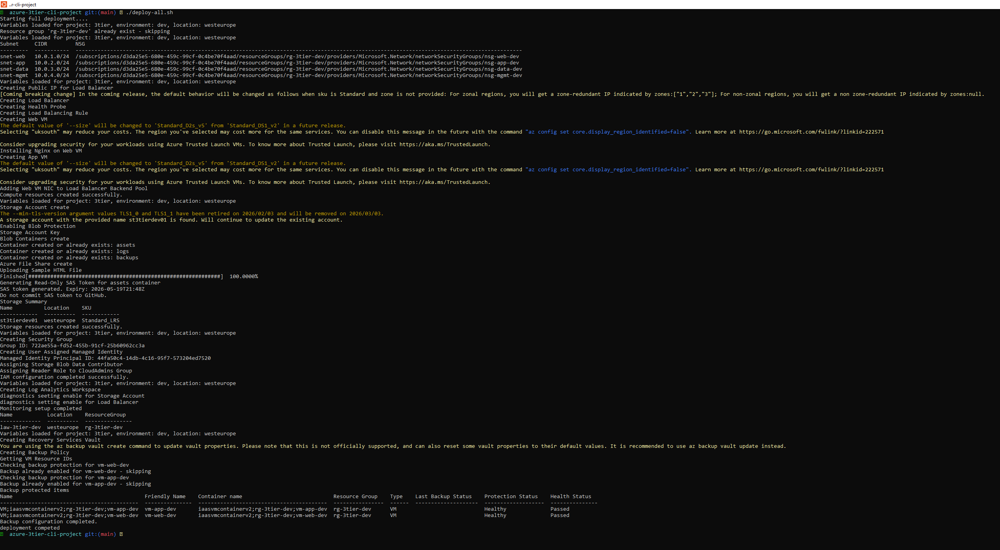
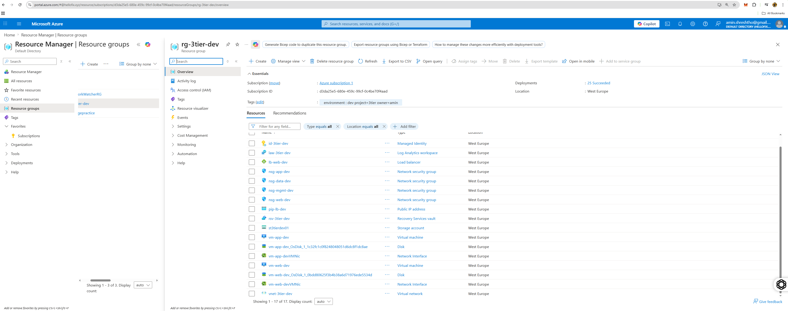

# Azure 3-Tier Infrastructure Automation with Azure CLI & Bash

> End-to-end Azure infrastructure deployment using Bash scripting and Azure CLI. This project provisions a complete 3-tier environment including networking, compute, storage, identity and access management, monitoring, and automated backup.

---

## ------------Project Description--------------------

This project demonstrates how to build and automate a complete 3-tier infrastructure in Microsoft Azure using Bash scripting and Azure CLI.

The goal of the project was to simulate how a cloud engineer would provision, configure, validate, and document an Azure environment using reusable and idempotent scripts rather than manual portal-based deployment.

The solution deploys a production-style environment consisting of:

- A dedicated Resource Group
- Virtual Network with segmented subnets for web, application, data, and management layers
- Network Security Groups (NSGs) for traffic control
- Standard Public Load Balancer
- Two Linux virtual machines representing the Web and Application tiers
- Azure Storage Account with Blob Containers and Azure File Share
- Microsoft Entra ID security group for administrative access
- User Assigned Managed Identity
- Role-Based Access Control (RBAC) assignments
- Log Analytics Workspace and Diagnostic Settings
- Recovery Services Vault with automated VM backup
- Resource Group delete lock for governance

All components are deployed through modular scripts that can be executed independently or orchestrated using a single `deploy-all.sh` script.

A companion `validate-project.sh` script performs a comprehensive post-deployment verification of all major Azure resources and saves the output to a structured report.

This project demonstrates practical experience with:

- Infrastructure automation using Azure CLI
- Bash scripting and modular script design
- Azure networking and compute services
- Storage and access control
- Monitoring and diagnostics
- Backup and disaster recovery
- Resource governance and protection
- Idempotent deployment patterns

The repository also includes architecture diagrams, validation reports, deployment logs, and screenshots to provide a complete and reproducible example of real-world Azure infrastructure automation.

## 🏗️ Architecture Diagram

```mermaid
flowchart TD
    A[User / Internet]
    B[Public Load Balancer]
    C[Web Tier<br>vm-web-dev<br>snet-web]
    D[App Tier<br>vm-app-dev<br>snet-app]
    E[Storage Tier<br>Storage Account<br>st3tierdev01]

    A --> B
    B --> C
    C --> D
    D --> E

    C --> F[Log Analytics Workspace]
    D --> F

    C --> G[Recovery Services Vault<br>VM Backup]
    D --> G

    H[Managed Identity] --> E
    I[CloudAdmins Group<br>RBAC Reader] --> J[Resource Group<br>rg-3tier-dev]
    K[Delete Lock] --> J

---

## 📸 Project Screenshots

### Deployment Execution



### Resource Group Overview



### Validation Report


---

## 🧱 Architecture Components

| Layer | Azure Services |
|------|------|
| Networking | Virtual Network, Subnets, NSGs, Public IP, Load Balancer |
| Compute | Linux Virtual Machines |
| Storage | Storage Account, Blob Containers, File Share |
| Identity | Entra ID Security Group, Managed Identity, RBAC |
| Monitoring | Log Analytics Workspace, Diagnostic Settings |
| Backup | Recovery Services Vault, Backup Policy |
| Governance | Resource Group Delete Lock |

---

## 🌐 Network Design

| Subnet | Address Space | Purpose |
|------|------|------|
| `snet-web` | `10.0.1.0/24` | Web tier |
| `snet-app` | `10.0.2.0/24` | Application tier |
| `snet-data` | `10.0.3.0/24` | Storage services |
| `snet-mgmt` | `10.0.4.0/24` | Management and security |

---

## 📁 Project Structure

```text
azure-3tier-cli-project/
├── config/
│   └── tags.json
│
├── docs/
│   ├── architecture-diagram.md
│   ├── teardown.md
│   ├── images/
│   │   ├── architecture-diagram.png
│   │   ├── DeployAll-Output.PNG
│   │   ├── Azure_portal_resources_overview.PNG
│   │   └── Validation_outout_1.PNG
│   │
│   └── outputs/
│       ├── deploy-all-output.txt
│       └── project-validation-output.txt
│
├── scripts/
│   ├── 00-variables.sh
│   ├── 01-resource-group.sh
│   ├── 02-networking.sh
│   ├── 03-compute.sh
│   ├── 04-storage.sh
│   ├── 05-iam.sh
│   ├── 06-monitoring.sh
│   ├── 07-backup.sh
│   └── teardown.sh
│
├── .gitignore
├── deploy-all.sh
├── validate-project.sh
└── README.md

## -----------------Quick Start--------------------------

### Prerequisites

- Azure subscription
- Azure CLI
- Bash shell (Linux/macOS/WSL)

### Deploy and Validate

```bash
git clone https://github.com/Amin-Azad/azure-3tier-cli-project.git
cd azure-3tier-cli-project

az login

chmod +x deploy-all.sh validate-project.sh scripts/*.sh

./deploy-all.sh
./validate-project.sh

## ---------------Deployment Workflow------------------

The `deploy-all.sh` script runs the following modules in sequence:

1. Resource Group
2. Networking
3. Compute
4. Storage
5. IAM and RBAC
6. Monitoring
7. Backup

---

##----------------- Core Components---------------------------

### Networking
- Virtual Network with 4 subnets
- Network Security Groups (NSGs)
- Standard Public Load Balancer

### Compute
- `vm-web-dev` – Web Tier
- `vm-app-dev` – Application Tier

### Storage
- Azure Storage Account
- Blob Containers (`assets`, `logs`, `backups`, `uploads`)
- Azure File Share

### Identity & Access
- `CloudAdmins` Microsoft Entra ID security group
- User Assigned Managed Identity
- RBAC role assignments

### Monitoring
- Log Analytics Workspace
- Diagnostic Settings

### Backup
- Recovery Services Vault
- Daily VM backups

### Governance
- Resource Group Delete Lock

---

## -------------- Validation------------------

The `validate-project.sh` script verifies all major resources, including:

- Networking
- Virtual Machines
- Storage
- RBAC assignments
- Monitoring
- Backup
- Resource Locks

Deployment and validation outputs are saved under:

```text
docs/outputs/

## -------------Cleanup--------------------------

To remove all resources created by this project, run:

```bash
bash scripts/teardown.sh

##---------------Key Skills Demonstrated-------------
- Azure CLI automation
- Bash scripting
- Azure networking
- Linux VM deployment
- Azure Storage and RBAC
- Managed Identities
- Monitoring and diagnostics
- Azure Backup
- Idempotent scripting

##-------------Future Improvements-----------
Convert the deployment to Bicep
Add Azure Bastion
Integrate Azure Key Vault
Add CI/CD with GitHub Actions


##-----------------Author----------

Amin Azad
AZ-104 Certified Azure Administrator
M.Sc. in Computer Science, Technical University of Denmark (DTU)
GitHub: https://github.com/Amin-Azad
LinkedIn: https://www.linkedin.com/in/aminazad/