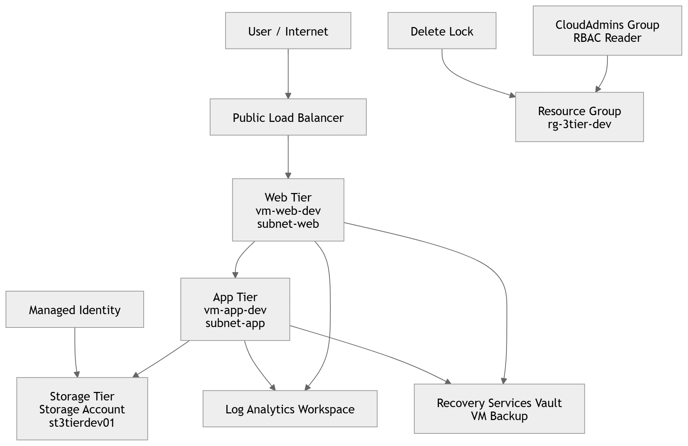
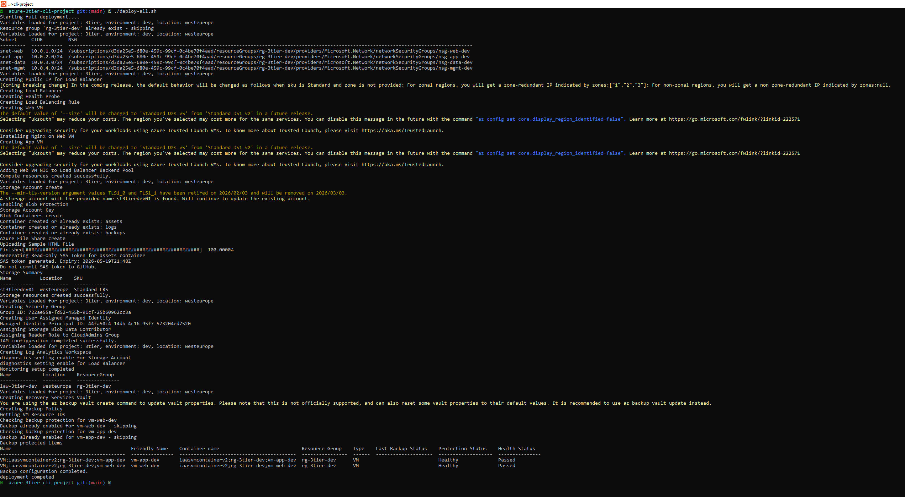
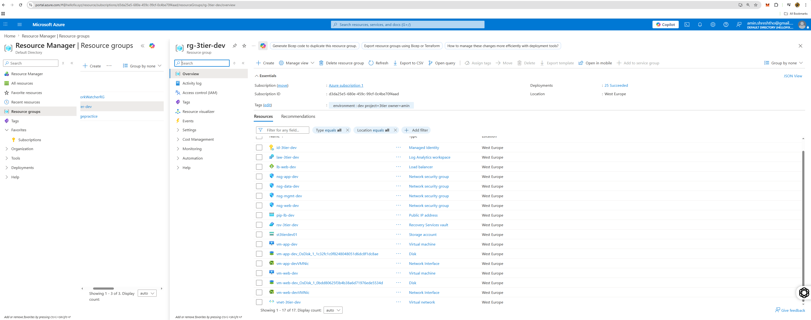
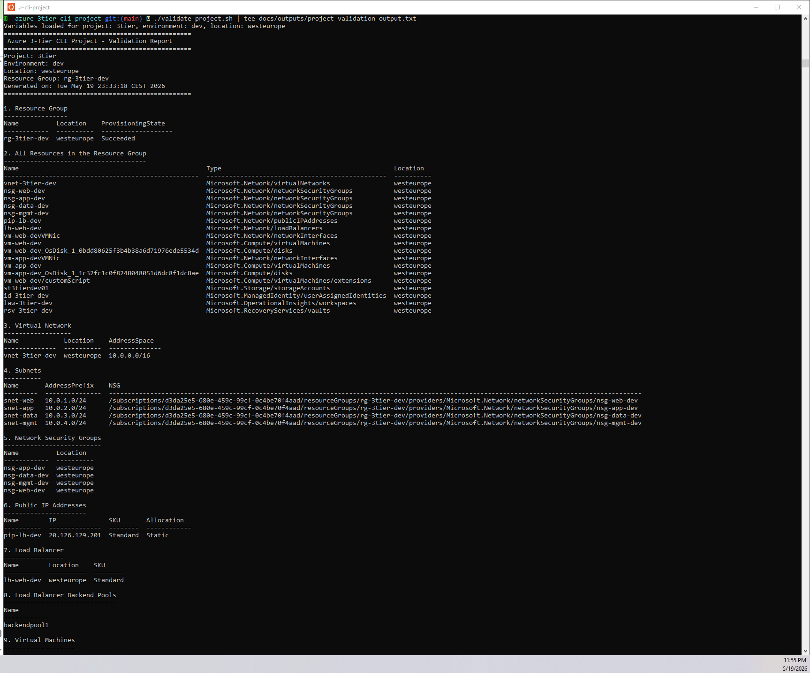
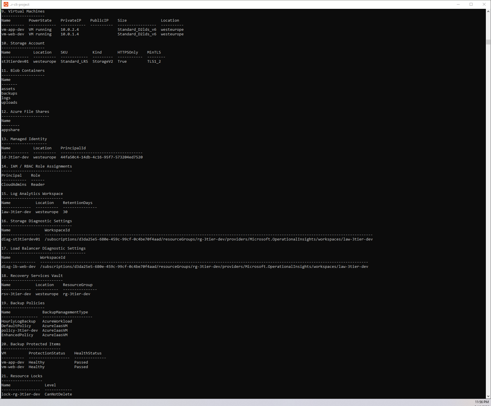

# Azure 3-Tier Infrastructure Automation with Azure CLI and Bash

[](https://azure.microsoft.com/)
[](https://www.gnu.org/software/bash/)
[](https://learn.microsoft.com/cli/azure/)

A complete three-tier Azure environment provisioned, validated and torn down using modular Bash scripts and the Azure CLI.

The project automates networking, compute, storage, identity, monitoring, backup and governance — with a matching validation script and cleanup path, so the environment can be created and removed repeatably.

---

## Architecture



| Layer | Azure Services |
| --- | --- |
| Networking | Virtual Network, Subnets, NSGs, Public IP, Load Balancer |
| Compute | Linux Virtual Machines |
| Storage | Storage Account, Blob Containers, File Share |
| Identity | Entra ID Security Group, Managed Identity, RBAC |
| Monitoring | Log Analytics Workspace, Diagnostic Settings |
| Backup | Recovery Services Vault, Backup Policy |
| Governance | Resource Lock, Tags |

### Network design

| Subnet | Address Space | Purpose |
| --- | --- | --- |
| `snet-web` | `10.0.1.0/24` | Internet-facing web tier |
| `snet-app` | `10.0.2.0/24` | Internal application tier |
| `snet-data` | `10.0.3.0/24` | Data and storage services |
| `snet-mgmt` | `10.0.4.0/24` | Management and administration |

---

## Deployment evidence

**Deployment execution**


**Azure portal resource overview**


**Validation report**



Raw output is preserved in `docs/outputs/`.

---

## Quick start

**Prerequisites:** an active Azure subscription · Azure CLI · Bash (Linux, macOS or WSL2) · Contributor or Owner role · an SSH key pair for the Linux VMs.

```bash
git clone https://github.com/Amin-Azad/azure-3tier-cli-project.git
cd azure-3tier-cli-project

az login
az account show --output table

chmod +x deploy-all.sh validate-project.sh scripts/*.sh

./deploy-all.sh
./validate-project.sh
```

Remove everything when finished:

```bash
bash scripts/cleanup.sh
```

---

## Script modules

`deploy-all.sh` runs these in sequence. The scripts are split by responsibility and share a central configuration file.

| Script | Purpose |
| --- | --- |
| `00-variables.sh` | Centralized project variables |
| `01-resource-group.sh` | Creates the resource group and applies a delete lock |
| `02-networking.sh` | Virtual Network, subnets, NSGs and public Load Balancer |
| `03-compute.sh` | Linux virtual machines for the web and application tiers |
| `04-storage.sh` | Storage account, blob containers and Azure File Share |
| `05-iam.sh` | Entra ID security group, managed identity and RBAC assignments |
| `06-monitoring.sh` | Log Analytics Workspace and diagnostic settings |
| `07-backup.sh` | Recovery Services Vault and VM backup |
| `cleanup.sh` | Removes all project resources and their dependencies |

`validate-project.sh` verifies the resource group, VNet and subnets, NSGs and Load Balancer, virtual machines, storage resources, managed identity and RBAC assignments, Log Analytics, Recovery Services Vault and backup status, and resource locks. Output is written to `docs/outputs/project-validation-output.txt`.

---

## Problems encountered and how they were resolved

Real Azure behaviour that static planning did not predict:

**Unregistered resource provider.** The Recovery Services Vault failed with `MissingSubscriptionRegistration` for `Microsoft.RecoveryServices`. New subscriptions do not have every provider registered by default — resolved with `az provider register`.

**Quota and SKU limits.** Some VM sizes were unavailable in the selected region and vCPU quota was insufficient. I used `az vm list-skus` and `az vm list-usage` to check available VM sizes and regional quota before retrying.

**Resource locks blocking teardown.** The `CanNotDelete` lock protecting the resource group also blocked automated cleanup. The teardown script now removes locks before deleting resources — governance controls have to be accounted for in both directions.

**Immutable storage.** Containers with immutability and versioning enabled could not be deleted until those settings were removed, which changes how cleanup must be sequenced.

**Regional dependencies.** Azure Backup requires the Recovery Services Vault to sit in the same region as the VMs it protects.

**SKU compatibility.** A Standard Load Balancer requires a Standard SKU public IP; mismatched SKUs fail at deployment time.

**Cost control during development.** Running VMs continuously generates avoidable cost. `az vm deallocate` preserves the environment while stopping compute charges.

---

## Skills demonstrated

Azure CLI automation · modular Bash scripting · three-tier network design · VNets, subnets, NSGs and Load Balancer · Linux VM provisioning · Entra ID, Managed Identity and RBAC · Azure Storage with blob versioning and immutability · Azure Monitor, Log Analytics and diagnostic settings · Azure Backup and Recovery Services Vault · resource governance with locks and tagging · troubleshooting live Azure deployment failures

## Possible extensions

Convert the deployment to Bicep · add Azure Bastion · integrate Azure Key Vault · add CI/CD with GitHub Actions

---

**Amin Azad** — AZ-104 Certified Azure Administrator · M.Sc. Computer Science and Engineering, DTU
[GitHub](https://github.com/Amin-Azad) · [LinkedIn](https://www.linkedin.com/in/azadamin079/)
