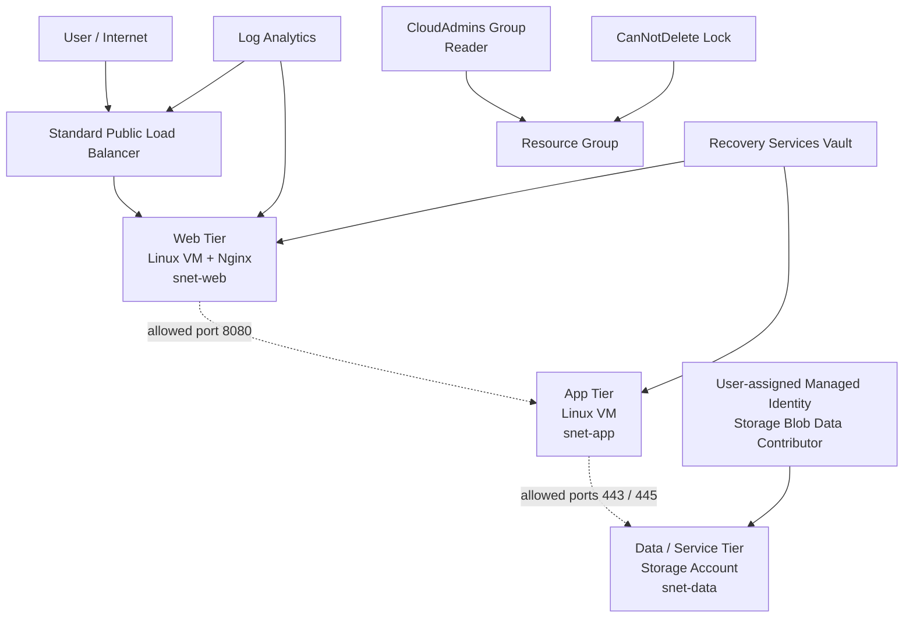

# Azure 3-Tier Architecture

This diagram shows the infrastructure layout created by the scripts. The web-to-app and app-to-data lines represent the network paths allowed by the NSGs; the project does not include a complete application using those paths.

